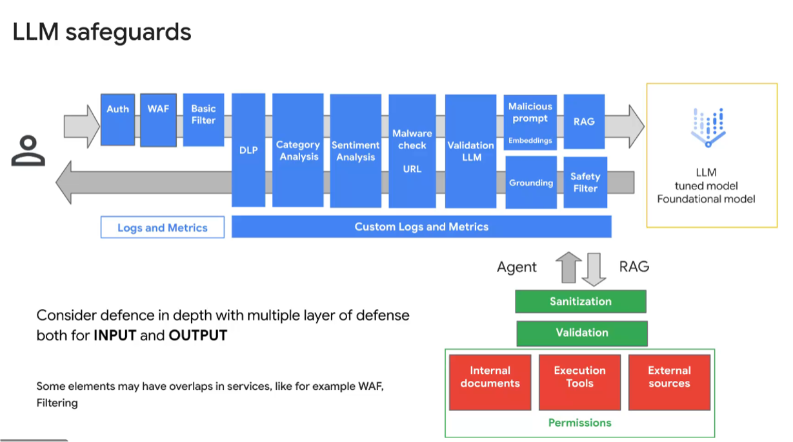

# responsible-ai-genai-safety
Responsible AI principal and safety guard design for GenAI application.

## Google Multi-Layered Defenses to Secure GenAI



- https://github.com/GoogleCloudPlatform/generative-ai/blob/main/gemini/responsible-ai/gemini_prompt_attacks_mitigation_examples.ipynb
- https://security.googleblog.com/2025/06/mitigating-prompt-injection-attacks.html
- https://docs.cloud.google.com/architecture/framework/perspectives/ai-ml/security
- https://cloud.google.com/blog/topics/developers-practitioners/building-a-production-ready-ai-security-foundation

### GCP Vertex AI Safety Filters

Vertex AI & Gemini has built-in content filtering, safety ratings, and the ability to define safety filter thresholds that are right for their use cases and business.

- sample
  - https://github.com/GoogleCloudPlatform/asl-ml-immersion/blob/master/notebooks/responsible_ai/safety/solutions/gemini_safety_ratings.ipynb
  - https://github.com/GoogleCloudPlatform/generative-ai/blob/main/gemini/responsible-ai/gemini_safety_ratings.ipynb

### GCP Model Armor
Model Armor is a Google Cloud service designed to enhance the security and safety of your AI applications. It works by proactively screening LLM prompts and responses
- https://docs.cloud.google.com/model-armor/manage-templates#set-confidence-level
- https://docs.cloud.google.com/model-armor/sanitize-prompts-responses
- https://github.com/alphasecio/model-armor
- https://www.skills.google/course_templates/1385?catalog_rank=%7B%22rank%22%3A1%2C%22num_filters%22%3A0%2C%22has_search%22%3Atrue%7D&search_id=65184237

---

##  1. Vertex AI Safety Filters vs Model Armor Filters

| 方面       | **Vertex AI Safety Filters**            | **Model Armor Filters**              |
| -------- | --------------------------------------- | ------------------------------------ |
| **服務類型** | 內建於 Gemini/Generative AI API 的安全／內容過濾功能 | 獨立的安全與內容過濾服務，可與 Vertex AI、Gemini 等整合 |
| **主要目標** | 阻止有害模型輸出（如仇恨言論、色情、危險內容）                 | 全面保護 AI 應用，涵蓋提示注入、敏感資料洩漏等進階威脅        |
| **應用層級** | 模型輸出安全過濾（主要聚焦「harm categories」）         | 輸入（Prompt）＋輸出（Response）皆可過濾與管理       |
| **配置方式** | 在模型請求內設定安全門檻（如 Block thresholds）        | 建立安全/策略「模板」，並能跨應用重用與集中管理             |


### Core Positioning

| Dimension | Vertex AI Safety Filters | Model Armor Filters |
|---|---|---|
| Service Type | Built-in model safety controls | Independent enterprise AI security service |
| Primary Focus | Harmful content generated by LLM | End-to-end GenAI application security |
| Coverage | Model output only | Prompt + response (before & after model) |
| Configuration | Per-request thresholds | Centralized reusable policy templates |
| Governance | App-level | Org / enterprise-level |

### Vertex AI Safety Filters

- Built-in with Gemini / Vertex AI Generative models
- Focus on **Responsible AI content safety**
- Harm categories:
  - Hate & Harassment
  - Sexually Explicit
  - Dangerous Content
- Configurable blocking thresholds (Low / Medium / High)
- Non-configurable enforcement for severe violations (e.g. CSAM)

**Limitations**
- No prompt injection detection
- No sensitive data leakage detection
- No centralized policy reuse across applications

---

### Model Armor Filters

- Standalone AI security service
- Template-based policy management
- Supports both **input (prompt)** and **output (response)** scanning

**Supported Protections**
- Responsible AI content filtering (confidence-based)
- Prompt injection & jailbreak detection
- Sensitive data (PII / PHI / Financial) detection
- Malicious URL detection

**Key Advantages**
- Centralized governance
- Reusable templates
- Integrates with SCC and enterprise security workflows

---

### When to Use Which

- **Vertex AI Safety Filters**
  - Basic content safety
  - Quick setup
  - Non-regulated or low-risk applications

- **Model Armor**
  - Enterprise / regulated industries
  - Unified GenAI guardrails
  - Defense against prompt-level attacks and data leakage

---

## 2. GCP GenAI Security Reference Architecture

### Design Principles

- Defense in Depth
- Separation of governance and model configuration
- Human accountability for high-risk decisions
- Full observability and auditability

---

## 3. Layer-by-Layer Security Mechanism Design

### Layer 0 – Network & API Boundary Security

**Goal**: Block unauthorized or abusive requests before reaching LLM

**Mechanisms**
- API Gateway / Cloud Endpoints
- IAM & Workload Identity
- Cloud Armor (WAF, rate limiting)
- Private Service Connect / mTLS

---

### Layer 1 – Prompt & Input Security (Before Model)

**Goal**: Prevent malicious or sensitive inputs

**Mechanisms**
- Model Armor (Input Scan)
  - Prompt Injection Detection
  - Jailbreak Detection
  - PII / PHI / Financial Data Detection
  - Malicious URL Detection

**Key Point**
- This layer is NOT covered by Vertex AI Safety Filters

---

### Layer 2 – LLM Generation Safety (During Model)

**Goal**: Prevent harmful or non-compliant model outputs

**Mechanisms**
- Vertex AI Safety Filters
  - Hate / Harassment
  - Sexual Content
  - Dangerous Content
- Multimodal coverage (text / image)

**Positioning**
- Responsible AI content safety
- Not a security control

---

### Layer 3 – Response & Data Protection (After Model)

**Goal**: Prevent data leakage or unsafe responses

**Mechanisms**
- Model Armor (Output Scan)
- DLP API (optional for high-risk systems)
- Output redaction or masking
- RAG response allowlisting

---

### Layer 4 – Human-in-the-Loop (HITL)

**Goal**: Ensure accountability for high-risk decisions

**Typical Policies**
- Auto-approve low-risk responses
- Require human review for:
  - Insurance claim decisions
  - Medical recommendations
  - Legal or financial advice

**Responsible AI Principle**
- Accountability and human oversight

---

### Layer 5 – Monitoring, Audit & Governance

**Mechanisms**
- Cloud Logging & Audit Logs
- BigQuery for prompt/response analytics
- Security Command Center integration
- Model Armor Floor Settings (minimum enforced policies)

**Key Metrics**
- Block rate (input/output)
- Injection attempt frequency
- Sensitive data hit rate
- HITL intervention ratio

---

## 4. End-to-End Secure GenAI Flow

```
User
 ↓
API Gateway + Cloud Armor
 ↓
Model Armor (Input Scan)
 ↓
Vertex AI (Safety Filters)
 ↓
Model Armor (Output Scan)
 ↓
Policy Engine
 ├─ Low Risk → Auto Response
 └─ High Risk → Human Review
 ↓
Logging / Audit / SCC
```

---

## 5. Recommended Enterprise Pattern

- Model Armor as **centralized GenAI Guardrail Gateway**
- Vertex AI Safety Filters for **model-level Responsible AI**
- HITL for regulated or high-impact decisions
- SCC for continuous security posture management

---

## 6. Common Anti-Patterns

- Only enabling Vertex AI Safety Filters
- No prompt injection protection
- No logging of prompts and responses
- Fully automated high-risk decision making

---

## 7. Summary

- Vertex AI Safety Filters = **Model content safety**
- Model Armor = **Enterprise GenAI security & governance**
- Responsible AI requires **process + people + platform**

---

## Multi-region ai gateway with Guardrail Architecture - LiteLLM
- https://docs.litellm.ai/docs/proxy/control_plane_and_data_plane
- https://docs.litellm.ai/docs/proxy/guardrails/guardrail_load_balancing

- getting started
https://docs.litellm.ai/docs/
